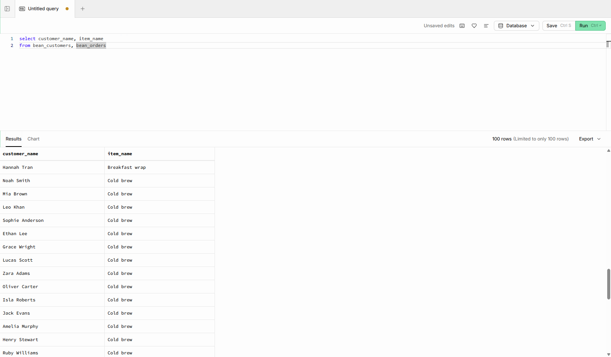
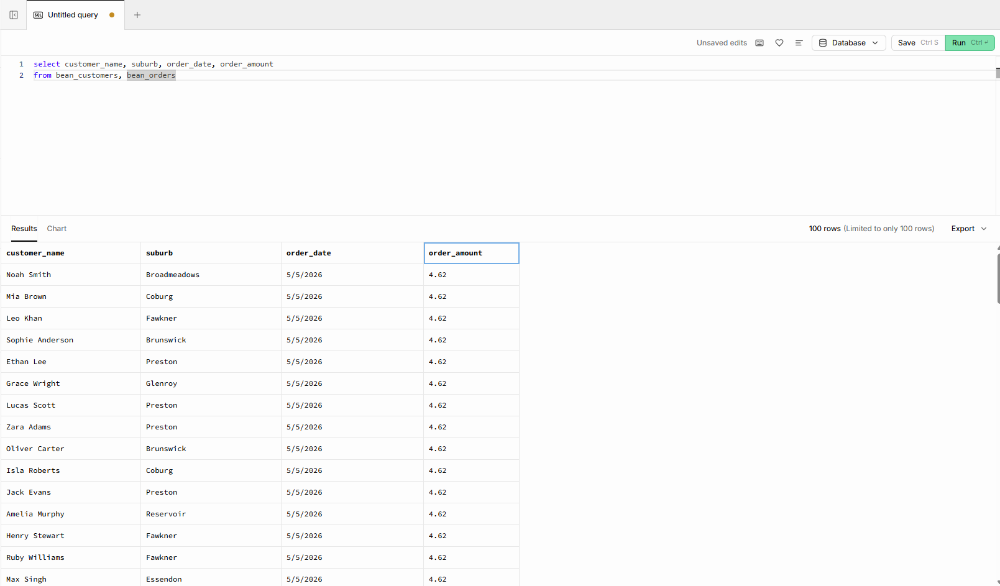

# 7. Intro SQL Join Exercises PostgreSQL.

 ### *1 Metro Beans Cafe:*
***

> 1. Display each order with the customer name and item name.

**select** customer_name, item_name
**from** bean_customers, bean_orders

> 2. Display customer name, suburb, order date, and order amount.

**select** customer_name, suburb, order_date, order_amount
**from** bean_customers, bean_orders

> 3. Find all orders made by Gold loyalty customers.

s
> 4. Find all orders from customers who live in Broadmeadows.

> 5. Display all orders where the order amount is greater than 15.

> 6. Display customer names and item names for all orders containing Latte.

> 7. Find all orders made by customers from Coburg or Glenroy.

> 8. Display all orders made after 2026-04-01.

> 9. Find Gold loyalty customers who spent more than 12 on an order.

> 10. Display customer name, loyalty level, item name, and order amount.

